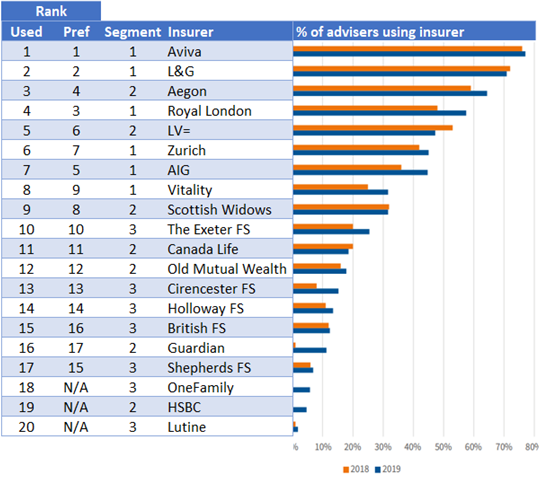

## Defaqto research: insurers preferred and used by advisers

Defaqto’s [2020 Protection Service Review](https://defaqto.com/advisers/publications/protection-service-review-2020/) is free on registering. Highlights of the 2019 review can be found [here](https://defaqto.com/media-centre/press-releases/defaqto-protection-service-review-results-announced1/) and [here](https://www.ftadviser.com/protection/2019/02/27/most-popular-protection-providers-revealed/). The research ranked protection providers according to advisers’ use and preferences. These results are summarized in the table below.

Defaqto also covered the most used products and [the top 10 service areas](/content/3buildingblocks/) for protection advisers.

## Most used and preferred insurers

Columns 1 and 2 show the most used and preferred insurers. Column 3 shows (part of) my segmentation: a reminder is [here](/content/2marketplayers/).

## What stands out

+ **More use of most.** It seems that most insurers were used more in 2019 than in 2018. Odd? Perhaps Canada Life and Zurich are going backwards. This was a survey of (only) 275 advisers.
+ **Aegon and LV=** have displaced two of my first segment insurers, for use and preference.
+ **Old Mutual Wealth** has [closed to new business](https://www.moneymarketing.co.uk/news/exclusive-ex-old-mutual-protection-arm-to-close-to-new-business/).
+ **Friendly Society Income Protection specialists** are headed by The Exeter followed by British, Cirencester, Holloway and Shepherds.Another is OneFamily, with its over-50s plan.
+ **Lutine** is a proudly specialist provider of shorter-term protection cover.
+ **HSBC** has had a life licence for years, re-entering the market with competitive rates in 2019.
