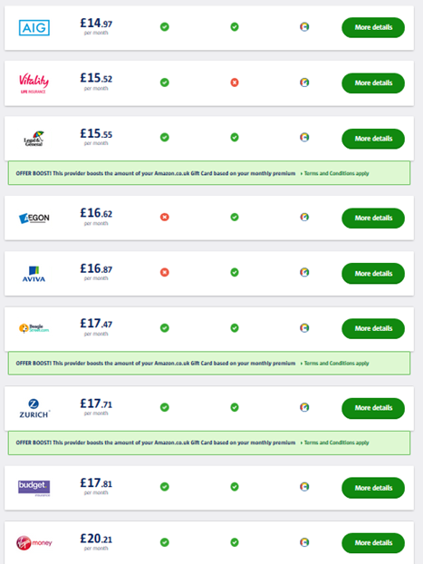
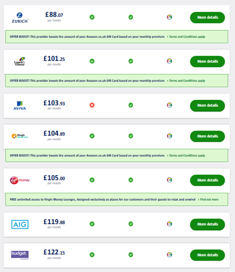

## Reinsurance magic1

All but one of the twelve largest protection insurers use substantial amounts of reinsurance. This has been their successful strategy since the 1990s with the top insurers reinsuring 100% since c2011.

This article shows why reinsurance works and what can happen if you don't use it.

## Reinsurance? Not so fast!

Our [building blocks of protection](/content/3buildingblocks/) article notes the importance of reinsurance and distribution, as well as five further items which affect advisers' profitability.

The need for distribution is obvious; advisers need to have confidence in your products and your new business process. Less clear is the case for 100% reinsurance. Doesn't that give all the profit away?

## Why reinsurance should work for you

Reinsurance has many benefits for the modern protection insurer, especially when 100% reinsurance is used. It can really help smaller insurers and protection specialists.

These benefits swamp the impact of the reinsurer's expenses and profits.

**Reinsurance can help you to:**

**Reduce uncertainty and clarify financials.** With no net claims profits are affected more by lapses than deaths. Insurer profits can be a simple function of retail and reinsurance premiums.

**Simplify operations.** Less time worrying about mortality assumptions means more time on essentials: volume, market pricing, underwriting, expenses, lapses and capital.

**Make competition work for you.** Are your pricing actuaries and underwriters lining up against sales and marketing? Reinsurers compete to drive down your biggest cost: claims.

**Avoid the winner's curse.** Specialists know the [winner's curse](https://en.wikipedia.org/wiki/Winner%27s_curse) operates in [group risk](https://www.actuaries.digital/2014/07/22/the-winners-curse/) markets and in [reinsurance](https://www.casact.org/education/clrs/2011/handouts/R3-Rozema.pdf). Let the curse work for you &mdash; or do better still.

**Be more ambitious and rigorous.** Reinsurers must be convinced by your plans, expertise and ability to deliver. Not all get through this stage. The need to deliver expected mortality experience requires a focus on distribution and underwriting.

**Manage capital.** Large composite insurers with general and life insurance operations, including annuities, protection, pensions and investment, may be as well diversified as reinsurers, with consequent capital benefits. More common are:

+ Life and pensions insurers e.g. Aegon, L&amp;G and Royal London.
+ Protection specialists e.g. AIG, Guardian and Vitality.
+ Friendly societies, often with one main product, e.g. Holloway.

Reinsurance passes through the benefit of a reinsurer's diversification.

There are two examples of insurers not using much reinsurance.

### Going it alone 1: Friendly Societies

Friendly Societies traditionally don't reinsure their Income Protection business. This leaves them vulnerable to downturns in morbidity experience.

Income Protection may be less price sensitive than other lines, but some designs might leave a Society open to poor experience. It's a risky product in any case.

Given their size, it's rather curious.

### Going it alone 2: a major insurer

Just one of the twelve largest protection insurers makes little use of reinsurance. Let's see their competitiveness in Q2 2020 for life and critical illness cover.

#### Life cover
<!--  -->

+ AIG is cheapest, by almost 4%.
+ Around 9% separates 2nd-5th.
+ Zurich is 7th, 18% off the pace.

| # | Insurer      | Cost (&pound;) |
|:-:|:-------------|------:|
| 1 | AIG          | 14.97 |
| 2 | Vitality     | 15.52 |
| 3 | L&amp;G      | 15.55 |
| 4 | Aegon        | 16.62 |
| 5 | Aviva        | 16.87 |
| 6 | Beagle St    | 17.47 |
| 7 | Zurich       | 17.71 |
| 8 | Budget       | 17.81 |
| 9 | Virgin Money | 20.21 |

**Source:** [comparethemarket](https://www.comparethemarket.com/) 14/04/2020: non-smoker, 40 next, 200K LTA, 25 years.

#### Critical illness cover
<!--  -->

+ Zurich is cheapest by over 12%.
+ Less than 4% separates 2nd-5th.
+ AIG and Budget are well off the pace.

| # | Insurer      | Cost (&pound;) |
|:-:|:-------------|------:|
| 1 | Zurich       |  88.07 |
| 2 | L&amp;G      | 101.25 |
| 3 | Aviva        | 103.93 |
| 4 | Beagle St    | 104.89 |
| 5 | Virgin Money | 105.00 |
| 6 | AIG          | 119.88 |
| 7 | Budget       | 122.15 |

**Source:** [comparethemarket](https://www.comparethemarket.com/) 14/04/2020: non-smoker, 40 next, 200K LTA, 25 years.

## The Zurich paradox

**Zurich is expensive for life cover.** This is illustrated by the single point above and my Q4 2019 research: Zurich had few top 5 positions.

**Zurich is too cheap for critical illness.** Again, this was also true in Q4 2019. With or without reinsurance, this is just leaving money on the table.

I initially thought that this could be Zurich's historic ownership of [Openwork](https://www.openwork.uk.com/). Perhaps Zurich committed to keeping Openwork rates within a certain percentage of IFA terms? Perhaps increasing IFA rates increases overall profit?

But Zurich [sold its remaining 25% stake in Openwork in 2018](https://www.moneymarketing.co.uk/news/zurich-sells-openwork/) so that seems unlikely.

What's more, in Q4 2019, it [sold its retail wealth management business to focus on protection](https://www.covermagazine.co.uk/news/4007181/zurich-uk-sells-retail-wealth-business-focus-protection). That suggests it should target a greater share of the IFA life market.

## How reinsurance could help Zurich

**For life cover** some say that 80% of sales go to the top 3. Perhaps its mortality assumptions are too conservative, but without reinsurance competitive rates means you are implicitly competing against the knowledge and pricing of six reinsurers in the UK market.

**For critical illness cover** undercutting the market by 10%+ seems absurd. Increasing prices, while remaining top, would almost certainly increase profits. But even here I'd prefer not to compete against six reinsurers.

There is a better way.

## The nightmare scenario

Imagine you don't use much reinsurance and that it becomes evident that your assumptions are too optimistic. Perhaps more people are dying than expected or mortality improvements have slowed or even reversed. Or similarly for the (less predictable) Critical Illness or Income Protection products.

Not only have your profits reduced (or disappeared) the "hit" has to be taken immediately: your corporate actuaries insist you put up extra capital. Worse, your regulator is restless.

Revisiting the first bullets, least risky first, we have:

+ Life and pensions insurers, including those most diversified
+ Protection specialists
+ Friendly societies, especially Income Protection specialists

Where are you on that list?

1. Reinsurance is not real magic but it helps.
