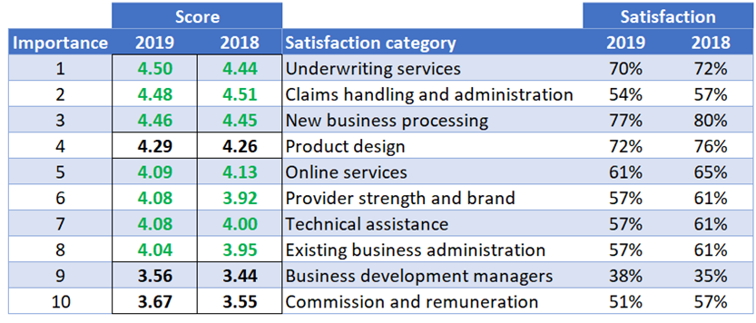

<!-- # Transformaction: optimize everything -->

## Building blocks

Here are the building blocks for protection success:

+ Reinsurance
+ Distribution
+ New business underwriting
+ Existing business servicing
+ Product design
+ Commission
+ Price

Look beyond the insurer to see why these are so important:

+ **Consumers** are affected by products, underwriting and price.
+ **Distributors** want sales (c.f. consumer factors) and commission.
+ **Reinsurers** drive modern individual protection business financials.

The building blocks fall into two groups:

+ **Wrapper items** important to the insurer: distribution and reinsurance.
+ **Core items** are the others, important to the adviser and his customer.

## The two wrappers

These determine the possibilities for and importance of the core items.

**Reinsurance terms** drive your pricing, support or limit your underwriting and largely set your business model and profitability. Choosing the right reinsurer, structure and level is therefore critical. Traditional tenders may not be the best option for all.

**Distribution channels** determine the importance of price and underwriting and affect mortality. In most channels analyzing the effect of different distributors &ndash; and taking appropriate action &ndash; offers scope for competitive advantage: a point increasingly recognized by insurers and reinsurers.

## Defaqto research

Defaqto's [2020 Protection Service Review](https://defaqto.com/advisers/publications/protection-service-review-2020/) is free on registering. Highlights of the 2019 review can be found [here](https://defaqto.com/media-centre/press-releases/defaqto-protection-service-review-results-announced1/) and [here](https://www.ftadviser.com/protection/2019/02/27/most-popular-protection-providers-revealed/). The 2020 report outlines advisers' most preferred and used insurers. It covers the factors they identify as most important:

**The categories are a little odd.** Underwriting (item 1) is a large part of new business processing (item 3). Online services (item 5) and existing business administration (item 8) also overlap.

**The gaps in the scores in 2019 and 2018 suggest four groups.** The first group (items 1-3) mainly covers new business processing, although claims is promoted to second place &ndash; perhaps due to consumers' distrust. The second group is product. Group three (items 5-8) concern ongoing support. The final group may show disdain for commission levels and business development managers.

**Price is not covered.** While this is a survey about service, price is always important: we only debate the extent. Demand for individual protection is price inelastic overall but elastic at the company level.

**The importance of brand is unclear.** There is limited research on the effect of brands in the IFA and aggregator markets. The detailed report contains surprising IFA opinions. It is doubtful that these always translate into purchasing actions, but see the [popularity of market players](/content/2marketplayers/).

## The five core items

Four come straight from the table and the importance of price is obvious.

**Bottom line:** success or failure will be driven by your processing efficiency (items 1-3). Fair payouts (item 2) matter. Including price would push claims down to fourth.

### Core 1: Product

Product features are in the public domain and can be copied.

Perhaps only two companies have taken product design forward: Scottish Provident in the 1990s with their menu range and Vitality's more recent emphasis on wellbeing and partial critical illness payments. Both were rewarded.

<!-- **Suggestion:** To generate momentum use standard product and terms at outset, then use a "fast follower" approach to competing on product where this has demonstrable value. -->

**Suggestion:** Generate momentum by using standard product and terms then combine an experimental and "fast follower" mindset to competing on product.

### Core 2: Underwriting

Take up rate drives profitability for IFAs and Tied agents: e-underwriting matters to them and you.

It is no surprise to see underwriting in top position. Entering most markets with too low a level of straight through processing is untenable: you will wreck the adviser's business and they will respond quickly. Conversely it seems the market leader has secured a worthwhile price premium.

**Suggestion:** Your underwriting is less visible to your competitors than product. Invest in this before launch, then use post-launch for improvement.

### Core 3: Existing business servicing

Claims is important enough to be lifted out of this category, securing second place. You should be seen to act fairly, in line with the [ABI guidance](https://www.abi.org.uk/globalassets/sitecore/files/documents/publications/public/migrated/health/abi-guidance-on-non-disclosure-and-treating-customer-fairly.pdf"). Expect a higher decline rate early on. Other items such as online alterations are less important.

**Suggestion:** Fair still means taking an appropriate line with non-disclosure, so agree your approach with your reinsurer(s). Pre-emptively monitor disclosures at the distributor level. Claims statistics are published but you could go further, using this as a sales tool.

### Core 4: Commission

At the bottom of the table, as usual. While an adviser can't really be seen to play up the importance of commission, they are clearly not happy with remuneration. Perhaps that applies to insurers too.

**Suggestion:** Be in the pack. Know that competing on earnings periods has an inevitable lapse effect.

### Core 5: Price

Prices have been less visible to competitors since 201+ Pricing gives real scope for competitive advantage for the imaginative; only a minority adopt modern techniques.

Price was outside the report's scope, but  but its role &ndash; in particular positioning on the portal displaying the quotes &ndash; is critical. The top three positions can take an 80% share.

Do you know you position on portals?

**Suggestion:** Work harder and smarter; pricing is a well-rewarded game of cat and mouse. At least don't undercut by 15%.

### Take the next step

So much for understanding the building blocks. The next step is [delivering](/content/4delivering/).
