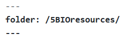

  
## How to set up a new file

## Method 1: new folder and index.md

  1. Set up a new folder and markdown file: maverickactuary.github.io/benfolder/index.md
  1. It appears to be empty, but in fact Jekyll does its magic using its templating.
  1. Note that at this point the menu doesn't get highlighted: you can't tell where you are.
  1. Now insert the following [front matter](https://www.youtube.com/watch?v=ZtEbGztktvc&index=5&list=PLLAZ4kZ9dFpOPV5C5Ay0pHaa0RJFhcmcB) at the top:

  

**Notes to self**

+ Neither raw nor escape ideas helped me show the front matter, hence the graphic above.
+ If index.md was all we had we would have to set up a new folder each time.

### Method 2: newfile.md and newfile.html

1. Create /5BIOresources/newfile.md, writing the content you want.
1. Carry out steps 2-4 above and commit.
1. You can view the formatted file newfile.html in the browser.

**What's happening?** Behind the scenes the files html files index.html and newfile.html corresponding to index.md and newfile.md are created. They are sent to some content delivery network.

You get the right content when you type the following:

+ /content/5resources/
+ /content/5resources/index.html
+ /content/5resources/newfile.html
